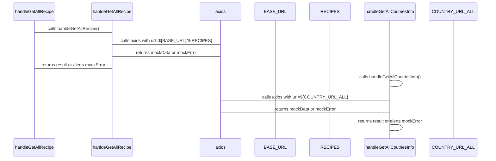
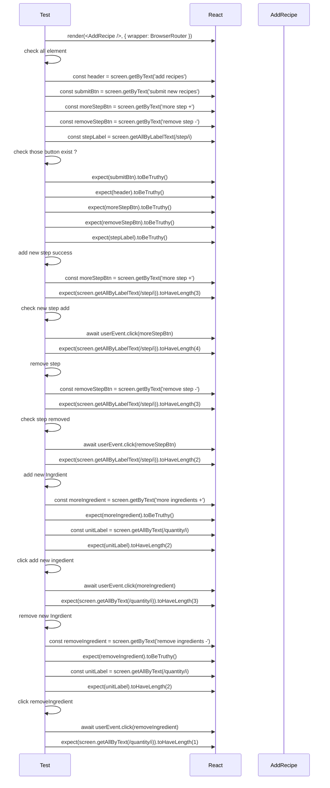
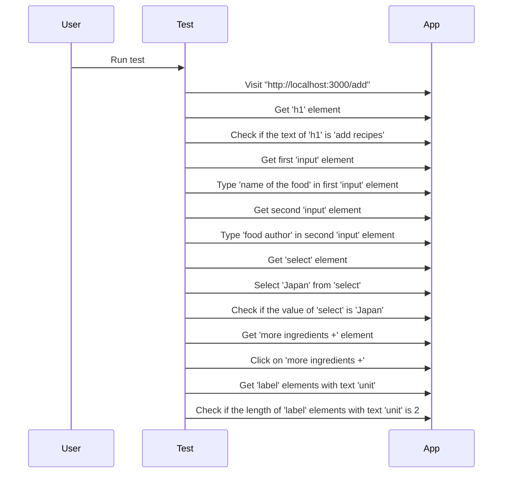
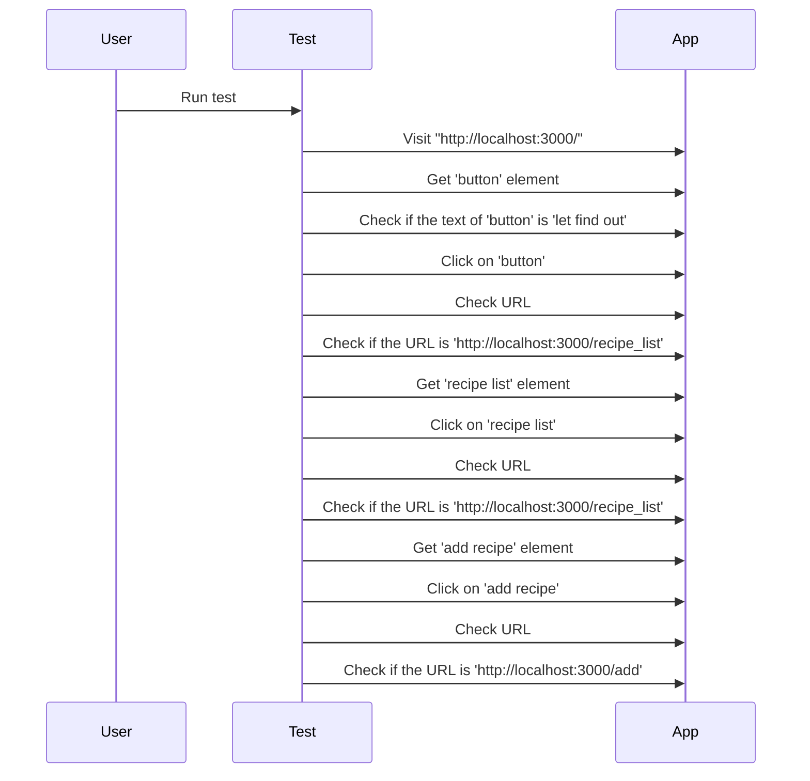

# Recipes food app 
1. The app is used to get food recipe which allow user can get cooking recipe.
2. User can also add their cooking recipe. 
---
# Teachnology:
1. front end: REACT JS 
2. UI: Tailwind CSS, 
3. back end: Json Server npm.
4. Testing: Jest, Cypress
---
#  Recipes function
1. review cooking recipes. 
2. add vs delete recipes. 
3. cooking recipes show all the information about:
    1. cooking time.
    2. food nutrition. 
    3. where the food come from. 
    4. material require.
4. searching function by country, author, food's name. 
---
# Start app: 

1. front end terminal:

```
npm start

```

2. back end terminal:

```
npm run server

```
3. use con use 1 comment line to run both back end and font end server. 

```
npm run dev
```
4. Unit testing

```
npm run test
```
5. E2E testing
```
npm run cypress:open
```
## Remember to run both terminal in seperate terminal. 
---
# application features: 

1. add food recipe 
    1. by name, 
    2. by country, 
    3. by cooking time,
    4. cooking step, 
    5. nutrition inside, 
    6. material required, 


    


2. review and searching for food by name, author or country: 


3. food recipe can be viewed in details throught pop-up or delete: 


## Unit Testing 

1. Tesing all App and button exists and work 
```mermaid
graph LR;
    Testing All the Button Exist in App --> render
    render --> BrowserRouter
    BrowserRouter --> App
    App --> homeBtn
    App --> addRouterButton
    App --> recipeRouteButton
    App --> findoutBtn
    homeBtn --> expect(homeBtn).toBeTruthy()
    addRouterButton --> expect(addRouterButton).toBeTruthy()
    recipeRouteButton --> expect(recipeRouteButton).toBeTruthy()
    findoutBtn --> expect(findoutBtn).toBeTruthy()
    homeBtn --> userEvent.click(homeBtn)
    recipeRouteButton --> userEvent.click(recipeRouteButton)
    addRouterButton --> userEvent.click(addRouterButton)
    findoutBtn --> userEvent.click(findoutBtn)

```
2. Test fetching 


3. Test add Recipes Component

4. Test all recipes list using 'msw' for testing server
1. [x] use 'msw' for testing server. 
2. [x] check all element show when server success load
3. [x] check if server error
4. [x] test details button, when it click, i can render those food recipes. 

## E2E Testing
1. Input test: 



2. Router:
